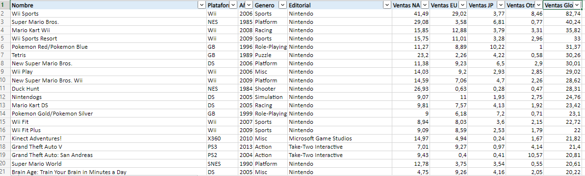
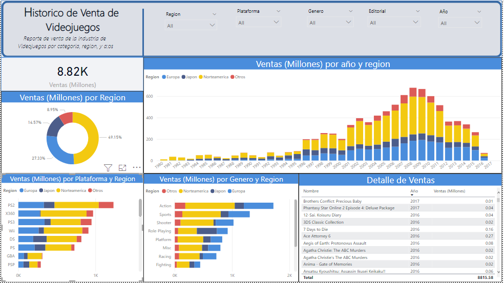

# Historical sale of video games

## Data visualization in PowerBI. They are historical data of video games sold around the world.
---
### The data is sorted by: 
* Region
* Yearr
* Genero
* Plataform
* Sales
---
## Antes

## Despues

---
